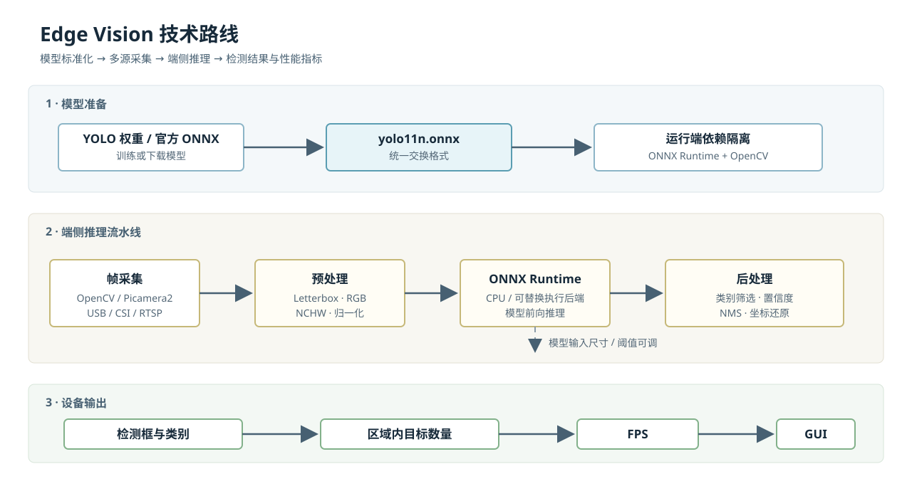
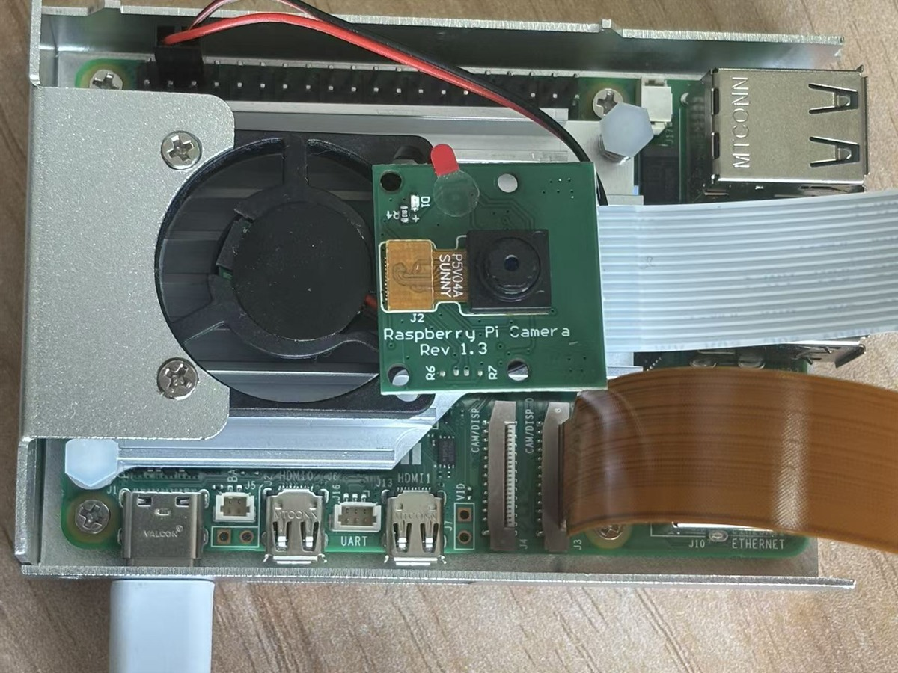
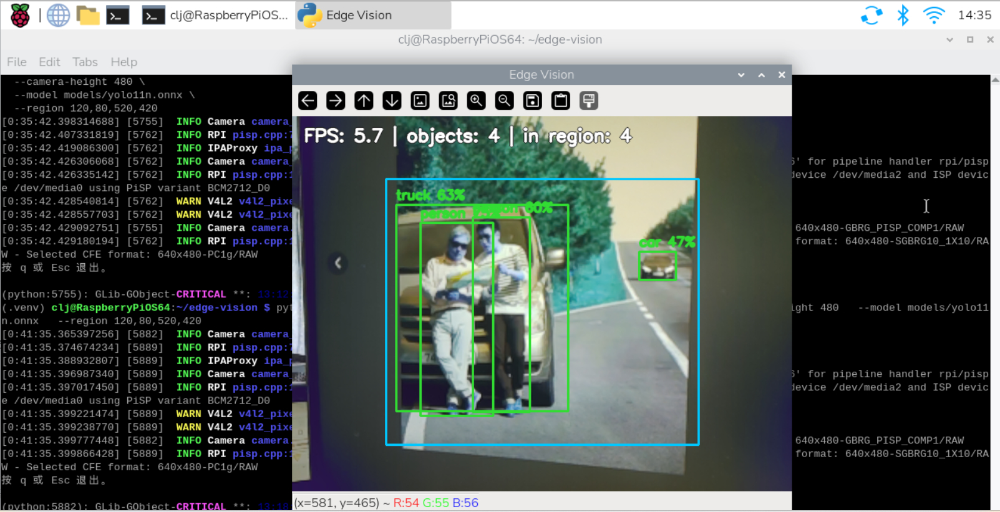

# Edge Vision

面向 Raspberry Pi 5 的实时边缘视觉基线工程。项目使用 YOLO ONNX 模型完成摄像头中的人车检测、矩形区域统计与实时性能显示，并提供从 Windows 笔记本验证到 Raspberry Pi CSI 摄像头部署的同一套推理代码。

## 功能范围

- YOLO ONNX 模型的 OpenCV 预处理、ONNX Runtime 推理、NMS 与坐标还原；
- OpenCV 摄像头、视频文件、RTSP 源，以及 Raspberry Pi CSI/Picamera2 采集后端；
- `person`、`car`、`bus`、`truck`、`motorcycle` 目标筛选；
- 指定矩形内的实时目标数量与滑动平均 FPS；
- 不依赖训练框架的运行端，便于迁移到 ARM 设备。

> 当前区域统计是“区域内实时数量”，不是跨线累计计数。

## 技术路线



模型构建与推理解耦：`ultralytics` 只在自训模型导出阶段使用；笔记本与树莓派运行时仅需 ONNX Runtime、OpenCV 和设备侧相机依赖。

## 快速开始

### Windows 笔记本

前置条件：Python 3.10+、可用摄像头。

```powershell
git clone https://github.com/chenljjj/edge-vision.git
cd edge-vision

py -m venv .venv
Set-ExecutionPolicy -Scope Process Bypass
.\.venv\Scripts\Activate.ps1
python -m pip install --upgrade pip
python -m pip install -r requirements-desktop.txt

python scripts/download_model.py
python -m unittest discover -s tests
python -m src.main --source 0 --region 120,80,520,420
```

默认 `--source 0` 使用第一个摄像头；可改为其他摄像头编号、视频文件路径或 RTSP 地址。按 `q` 或 `Esc` 退出。

### Raspberry Pi 5 + CSI 摄像头

前置条件：64-bit Raspberry Pi OS Desktop、已正确连接 CSI 排线与摄像头模组。当前程序使用 `cv2.imshow`，首次运行应通过 HDMI 或 Raspberry Pi Connect 打开图形桌面。

```bash
git clone https://github.com/chenljjj/edge-vision.git ~/edge-vision
cd ~/edge-vision

sudo apt update
sudo apt install -y python3-venv python3-opencv python3-picamera2
rpicam-hello --list-cameras
rpicam-hello --nopreview --timeout 3000

python3 -m venv --system-site-packages .venv
source .venv/bin/activate
python -m pip install --upgrade pip
python -m pip install -r requirements-pi.txt
python scripts/download_model.py

python -m unittest discover -s tests
python -m src.main \
  --camera-backend picamera2 \
  --camera-width 640 \
  --camera-height 480 \
  --model models/yolo11n.onnx \
  --region 120,80,520,420
```

较旧系统可能使用 `libcamera-hello` 替代 `rpicam-hello`。若 `onnxruntime` 导入提示缺少 `libgomp.so.1`，执行 `sudo apt install -y libgomp1`。

## 部署实测

### Raspberry Pi 5 CSI 接线



CSI 摄像头模组通过排线接入 Raspberry Pi 5 的摄像头接口，运行时由 Picamera2/libcamera 采集视频帧。

### 检测运行结果



实测画面显示检测框、目标类别、置信度、区域内对象数量和实时 FPS；示例中推理 FPS 为 5.7。

## 运行参数

| 参数 | 默认值 | 说明 |
| --- | --- | --- |
| `--model` | `models/yolo11n.onnx` | ONNX 模型路径 |
| `--source` | `0` | OpenCV 后端的视频源：摄像头编号、文件或 RTSP 地址 |
| `--camera-backend` | `opencv` | `opencv` 或树莓派 CSI 使用的 `picamera2` |
| `--camera-width` / `--camera-height` | `640` / `480` | Picamera2 输出分辨率 |
| `--confidence` | `0.45` | 置信度阈值 |
| `--iou` | `0.45` | NMS IoU 阈值 |
| `--region` | 无 | 统计区域，格式 `x1,y1,x2,y2` |
| `--classes` | 人车相关 5 类 | 要显示和统计的 COCO 类别名称 |

## 工程结构

```text
src/
  camera.py             # OpenCV 与 Picamera2 帧采集适配层
  detector.py           # Letterbox、ONNX Runtime、后处理和 NMS
  geometry.py           # 区域参数与坐标判定
  labels.py             # COCO 类别表
  main.py               # CLI、推理循环、绘制与实时统计
scripts/
  download_model.py     # 下载并校验官方 YOLO11n ONNX 模型，支持断点续传
  export_yolo.py        # 可选：将 YOLO 权重导出为 ONNX
tests/
  test_geometry.py      # 无硬件依赖的区域判定测试
requirements-*.txt      # 笔记本、树莓派和模型导出的依赖边界
```

## 验收标准

```bash
python -m unittest discover -s tests
```

输出 `OK` 表示区域参数和点位判定通过。端侧运行时还应确认：

1. `rpicam-hello --list-cameras` 能识别 CSI 摄像头；
2. 程序窗口连续显示画面与检测框；
3. 画面左上角有非零 FPS；
4. 目标中心进入蓝色矩形时，检测框变绿，`in region` 数值变化。

## 自训或替换模型

默认模型由 `scripts/download_model.py` 下载。使用自训 YOLO 权重时，在模型构建机执行：

```powershell
python -m pip install -r requirements-export.txt
python scripts/export_yolo.py
```

将导出的文件放入 `models/yolo11n.onnx`，或通过 `--model` 指定其他路径。导出模型必须保留标准 YOLO 检测输出，供现有后处理解析。
